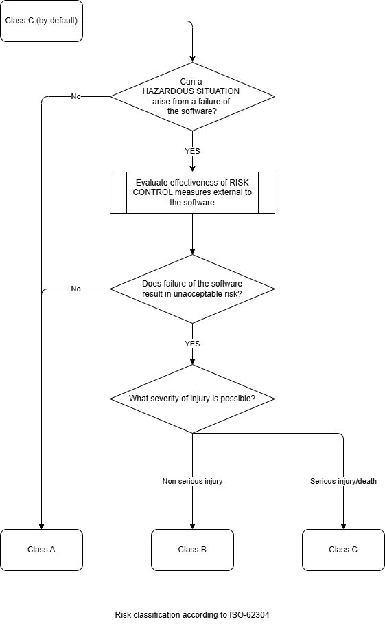
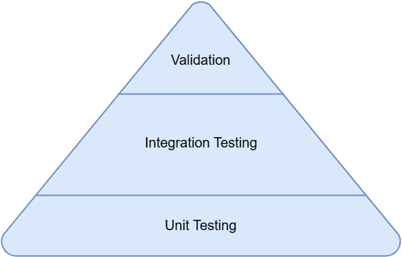

# Guidelines for Bio-IT validation

These guidelines suggest approaches for validating bioinformatics pipelines and are not intended to be prescriptive standards. 
Organizations should adapt these recommendations to their specific contexts, regulatory requirements, and research objectives. While we aimed to incorporate current best practices, 
the rapidly evolving nature of bioinformatics means that additional or alternative validation strategies may be appropriate. These guidelines do not guarantee regulatory compliance, 
and users remain responsible for ensuring that their validation procedures meet all applicable legal and ethical requirements for their intended applications. Users should consult 
with domain experts when implementing these recommendations in specialized contexts. This document is intended for use within a BELAC-accredited laboratory framework, conforming to ISO-15189 requirements. 

## 1. Bio-IT Validation Setup

There should be a clear distinction between Bio-IT validation and clinical validation. The validation of Bio-IT methods, software, and pipelines should be done according to the In-Vitro Diagnostic Regulation (IVDR), 
Medical Device Regulation (MDR), Artificial Intelligence Act (AIA), Data Act (DA) and Data Governance Act (DGA), focusing on the IT-related parts and basic outcome. The IVDR regulation specifies this should happen in 
accordance with the state of the art (annex 1, 16.2) for which GAMP5 and/or ISO-62304 guidelines can be used as inspiration. 

The (clinical) validation on use of this software/pipeline should be done by the user (biologist), supported by the bioinformaticians, according to the BELAC regulation. 

## 2. Validation Scope

A scope is the defined boundary or extent of what something covers or includes. In the context of validation, the scope defines the specific parameters, objectives, and limitations of the work to be done. 
It clarifies what is included in (and excluded from) the project or validation effort, establishing clear boundaries for what will be addressed and accomplished. 

In the Bio-IT validation, the scope establishes the operational boundaries and verification targets for the Bio-IT pipeline infrastructure. The scope encompasses end-to-end validation of computational workflows from data 
acquisition through analysis and reporting, with particular emphasis on reproducibility, accuracy, and data integrity. 

It should clearly define the goals of the validation, including the specific compliance of requirements such as the ISO standards or the laboratory's internal quality management system. The scope is refined through 
collaboration between researchers, bioinformaticians, and quality assurance personnel. The final scope aligns with the intended use of pipeline outputs and associated risk classifications and 
addresses any validation gaps not covered by other existing validation documentation.   

## 3. Risk assessment

Risk assessment should focus specifically on data leaks, data confidentiality, and compliance with GDPR regulations. 
Risks are defined as the possible negative interaction between software and the IT environment within which it operates and interacts.  

The Medical Device Coordination Group ([MDCG infographic](https://health.ec.europa.eu/document/download/b865d8e9-081a-4601-a91a-f120321c0491_en?filename=md_mdcg_2021_mdsw_en.pdf)) can assist in determining whether 
software qualifies as Medical Device Software according to the MDR/IVDR regulations. 

> Note: Visualization and database APIs in themselves, are not considered Medical Device Software. These can hence be considered not to be part of the software/pipeline in which case they should be validated separately. 
Validation in those cases could be limited to unit-testing for APIs and visual testing for visualizations and interfaces. 

For all Medical Device Software, the IVDR risk class should be determined and stated 
(see [IVDR-Rules-Flowchart-Graphic-F.pdf](https://www.thermofisher.com/blog/oempowered/wp-content/uploads/sites/21/2022/03/PG2692-PJT8733-COL117265-IVDR-Rules-Flowchart-Graphic-F.pdf)). 
This can be supplemented by other risk classifications (e.g. ISO-62304, Figure 1); however, this is not mandatory. 

It is recommended to perform continuous risk assessment triggered by significant changes or events, such as updates to the pipeline, reference data, infrastructure, or the occurrence of deviations and incidents. 
Risk classification should define the required level of control, including the extent of impact assessment, change control, regression testing, and (re-)validation activities. 

In certain settings, periodic review of the pipeline’s performance and risk profile should be conducted to detect potential data drift or performance degradation, ensuring that the pipeline remains fit for its intended clinical use. 

<figure>
    
    <figcaption>The risk classification according to ISO-62304.</figcaption>
</figure>

## 4. Project design

To comply with the IVDR Article 5.5, a rigorous market study before implementation is performed. 
This market analysis is required to determine whether an equivalent, commercially available CE-IVD marked software solution exists that can meet the specific clinical needs of the target patient group. 
Criteria can include but are not limited to specialized variant calling parameters, custom gene panel filtering or integrations with laboratory information systems. 

The process begins with a high-level architectural design (equivalent to project specifications or a requirements document). This document describes the software's functional requirements, intended use, 
the context of its use, and overall project objectives. Preferably, this is accompanied by a schematic overview (or flowchart) with a basic description of all pipeline/software components and steps. 
The steps of the flow chart should be documented enough so that it would be understandable which are the needed input and requirements of the steps (e.g. external connection, API access, ...)  

From the initial design phase, confidentiality (protecting data from unauthorized access accord and following the GDPR regulations), integrity (ensuring data accuracy and preventing unnoticed changes), 
availability (guaranteeing access for authorized users), as well as the risks identified from the risk assessment step are explicitly addressed through measures such as encryption, access controls, checksums, and redundant systems. 

Based on the design specification, a comprehensive technical design is created, describing the different steps or parts of your project in depth. It includes aspects such as the software architecture 
(e.g., client-server, web-based), algorithms, data structures, and interfaces with other systems (APIs, file transfers, etc.), ... 

## 5. Code Development

Development should never happen directly in a production environment, ideally you separate development, testing and production environment whether virtually or physically on segregated infrastructure.  

Code development is the practical implementation of the project. Whether based on the original project design or feature request and bug reports. All changes should be tracked in an appropriate way, 
preferable immutable and verifiable, for example with version control software such as GitHub, GitLab or Jira.  

Feature requests and bugs should be tracked. Tracking can be done by using the issues system (as provided in GitHub, GitLab, ...), through dedicated software (e.g. Jira) or via other in-house systems (e.g. incorporated in the quality management system). 

If possible, checks like the 4-eyes principle should be implemented by testing the code by 2 different people, or by testing the code on 2 different machines (2 different servers or 2 different nodes within the server). 

All code and development should be tracked via a source version control management system (git, svn, ...). Code used in the production environment should be labeled and protected by protected tags or branches.  

Extra care should be taken with the usage of Software of Unknown Provenance (SOUP). SOUPs can include, but are not limited to:  
- In house libraries 
- Open-source software 
- Software of the firm (e.g. BCL Convert of Illumina, Dorado of ONT) 

It is recommended to include all SOUPs: name, version and link to download page. Moreover, the SOUPs should be mentioned and tested as part of the unit/integration tests (see below). 

## 6. Software Verification

Software verification occurs at three levels (Examples according to [semantic versioning](https://semver.org/)):  
- Unit tests verify individual components for correct behavior, aligning with patch releases (e.g., 1.0.1).  
- Integration tests ensure proper interaction between components, corresponding to minor releases (e.g., 1.1.0).  
- Finally, end-to-end tests validate the entire application flow and user experience, justifying major releases (e.g., 2.0.0) when significant changes or new features are introduced.  

Crucially, all tests must be documented and executed in a traceable, provable manner, providing evidence of verification activities and ensuring reproducibility. 

<figure>
    
    <figcaption>Testing of the individual components is the base for verification, followed by integration testing and the end-to-end testing for validation.</figcaption>
</figure>

## 7. Validation

The nature and content of the validation are highly dependent on the scope of the software. The fundamental goal is to examine whether the defined objectives set during the project design and in the scope are met. 
It is the last formal check before deployment or release to production, 
and focuses on demonstrating that the software performs as expected in a real-world or simulated real-world environment. It should adhere to best practice standards which should be verified by benchmarking when possible. 

For software updates, the extent of the validation should differ correspondingly to the versioning as mentioned above. The above-mentioned impact analysis can assist in defining the validation steps needed, going from bug-fixes to major changes. 

Used data should be clearly described according to the principles of the AIA, DA, DGA, and FAIR principle. With a clear focus on data characteristics (which data is used), data management (where this data is kept) 
and data quality (relevance and representative). If AI or ML were developed, a clear description of the train/validation/test sets should be included, together with the possible bias of the algorithm. 

## 8. Release Procedure

List what actions are taken once a pipeline is entered into production.  
- How are the stakeholders informed of the release of a new version.  
- How are relevant training sessions scheduled/performed. 
- How can the users share their experience and eventual improvements. 
- A release log (easy to understand change log + release dates). 

Before each production deployment, a backup of the previous deployment needs to be created, as part of a fallback procedure. It is recommended to create a protected branch or tag in the versioning system with a clear name, e.g. semantic versioning. 

## 9. Monitoring and Continuous assessment

Following initial validation efforts, continuous assessment of the pipeline performance (clinical or technical) is to be performed. 

A tracing or logging system of execution and failures of the software should be in place. It is highly recommended to employ an alert system to notify the stakeholders and/or the maintainers of the software. 
Furthermore, each sample should be unambiguously linked to the version of the software used for analysis.  

## 10. References

Regulation (EU) 2017/746 of the European Parliament and of the Council of 5 April 2017 on in vitro diagnostic medical devices and repealing Directive 98/79/EC and Commission Decision 2010/227/EU. 
(In-Vitro Diagnostic Regulation). (IVDR) [https://eur-lex.europa.eu/legal-content/EN/TXT/?uri=CELEX%3A32017R0746](https://eur-lex.europa.eu/legal-content/EN/TXT/?uri=CELEX%3A32017R0746)

Regulation (EU) 2017/745 of the European Parliament and of the Council of 5 April 2017 on medical devices, amending Directive 2011/83/EC, Regulation (EC) No 178/2002 and Regulation (EC) 
No 1223/2009 and repealing Council Directives 90/385/EEC and 93/42/EEC. (Medical Device Regulation) (MDR) 
[https://eur-lex.europa.eu/legal-content/EN/TXT/?uri=CELEX%3A32017R0745&qid=1775058657188](https://eur-lex.europa.eu/legal-content/EN/TXT/?uri=CELEX%3A32017R0745&qid=1775058657188) 

Regulation (EU) 2024/1689 of the European Parliament and of the Council of 13 June 2024 laying down harmonised rules on artificial intelligence and amending Regulations (EC) No 300/2008, (EU) No 167/2013, 
(EU) No 168/2013, (EU) 2018/858, (EU) 2018/1139 and (EU) 2019/2144 and Directives 2014/90/EU, (EU) 2016/797 and (EU) 2020/1828 (Artificial Intelligence Act). (AIA) 
[https://eur-lex.europa.eu/legal-content/EN/TXT/?uri=CELEX%3A32024R1689&qid=1775058690578](https://eur-lex.europa.eu/legal-content/EN/TXT/?uri=CELEX%3A32024R1689&qid=1775058690578 )

Regulation (EU) 2023/2854 of the European Parliament and of the Council of 13 December 2023 on harmonised rules on fair access to and use of data and amending Regulation 
(EU) 2017/2394 and Directive (EU) 2020/1828 (Data Act). (DA) [https://eur-lex.europa.eu/eli/reg/2023/2854/oj/eng](https://eur-lex.europa.eu/eli/reg/2023/2854/oj/eng) 

Regulation (EU) 2022/868 of the European Parliament and of the Council of 30 May 2022 on European data governance and amending Regulation (EU) 2018/1724 (Data Governance Act). 
(DGA) [https://eur-lex.europa.eu/legal-content/EN/TXT/?uri=CELEX%3A32022R0868&qid=1775058712660](https://eur-lex.europa.eu/legal-content/EN/TXT/?uri=CELEX%3A32022R0868&qid=1775058712660) 

Schneider F., Maurer C., Friedberg R.C. (2017). International Organization for Standardization (ISO) 15189. Annals of Laboratory Medicine, 37(5), 365-370. [https://doi.org/10.3343/alm.2017.37.5.365](https://doi.org/10.3343/alm.2017.37.5.365)  

Roy, S., Coldren, C., Karunamurthy, A., Kip, N. S., Klee, E. W., Lincoln, S. E., Leon, A., Pullambhatla, M., Temple-Smolkin, R. L., Voelkerding, K. V., Wang, C., & Carter, A. B. (2018). 
Standards and Guidelines for Validating Next-Generation Sequencing Bioinformatics Pipelines. The Journal of Molecular Diagnostics, 20(1), 4–27. [https://doi.org/10.1016/j.jmoldx.2017.11.003](https://doi.org/10.1016/j.jmoldx.2017.11.003)

Roy, S. (2022). Principles and Validation of Bioinformatics Pipeline for Cancer Next-Generation Sequencing. Clinics in Laboratory Medicine, 42(3), 409–421. [https://doi.org/10.1016/j.cll.2022.05.006](https://doi.org/10.1016/j.cll.2022.05.006 )

EU AI Act: first regulation on artificial intelligence | Topics | European Parliament. (2023, August 6). Topics | European Parliament. 
[https://www.europarl.europa.eu/topics/en/article/20230601STO93804/eu-ai-act-first-regulation-on-artificial-intelligence](https://www.europarl.europa.eu/topics/en/article/20230601STO93804/eu-ai-act-first-regulation-on-artificial-intelligence)

Artificial Intelligence Board (AIB), Medical Device Coordination Group (MDCG) (2025) Interplay between the Medical Devices Regulation (MDR) and In vitro Diagnostic Medical Devices Regulation (IVDR) 
and the Artifical Intelligence Act (AIA) [https://health.ec.europa.eu/document/download/b78a17d7-e3cd-4943-851d-e02a2f22bbb4_en](https://health.ec.europa.eu/document/download/b78a17d7-e3cd-4943-851d-e02a2f22bbb4_en)

MedicalDeviceHQ (2024, January 25). The illustrated guide to medical device software development and IEC 62304 
[https://medicaldevicehq.com/articles/the-illustrated-guide-to-medical-device-software-development-and-iec-62304/](https://medicaldevicehq.com/articles/the-illustrated-guide-to-medical-device-software-development-and-iec-62304/)

ISPE (2022). GAMP5: A Risk-Based Approach to Compliant GxP Computerized Systems (Second Edition). International Society for Pharmaceutical Engineering 

Wilkinson, M. D., Dumontier, M., Aalbersberg, Ij. J., Appleton, G., Axton, M., Baak, A., Blomberg, N., Boiten, J.-W., da Silva Santos, L. B., Bourne, P. E., Bouwman, J., 
Brookes, A. J., Clark, T., Crosas, M., Dillo, I., Dumon, O., Edmunds, S., Evelo, C. T., Finkers, R., … Mons, B. (2016). The FAIR Guiding Principles for scientific data management and stewardship. Scientific Data, 3(1). 
[https://doi.org/10.1038/sdata.2016.18](https://doi.org/10.1038/sdata.2016.18)

Preston-Werner, T. (n.d.) Semantic Versioning 2.0.0. Semantic Versioning [https://semver.org/](https://semver.org/)  

Field standard bioinformatics. (n.d.). [https://vkgl-kwaliteit.github.io/BioinformaticaVeldnorm/](https://vkgl-kwaliteit.github.io/BioinformaticaVeldnorm/) 
